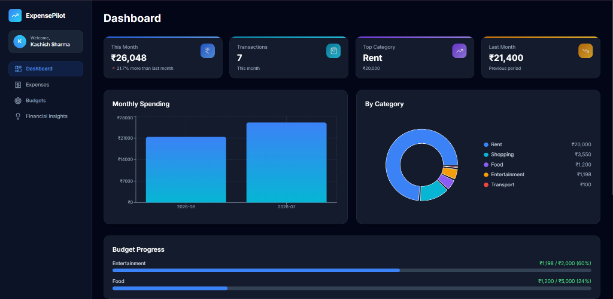
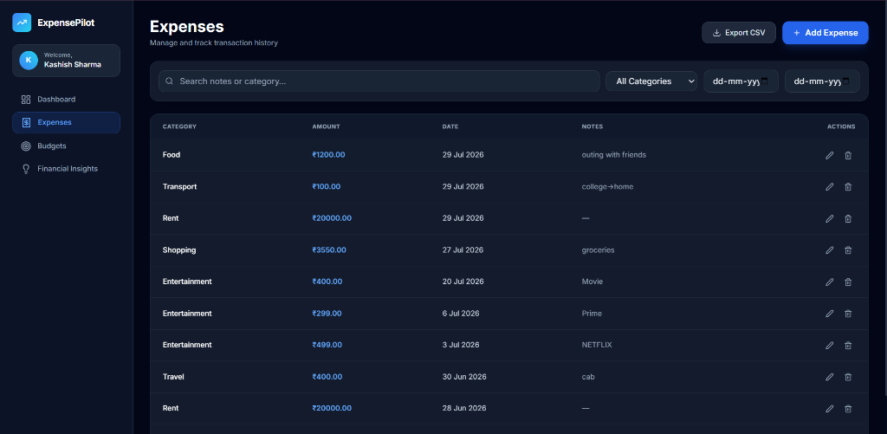
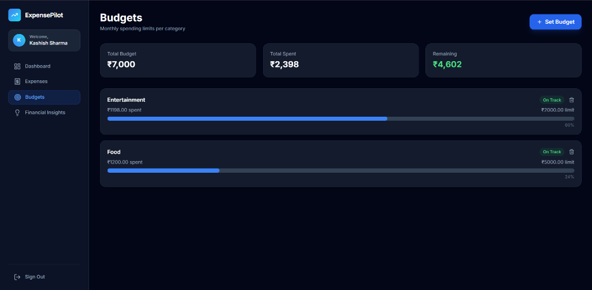
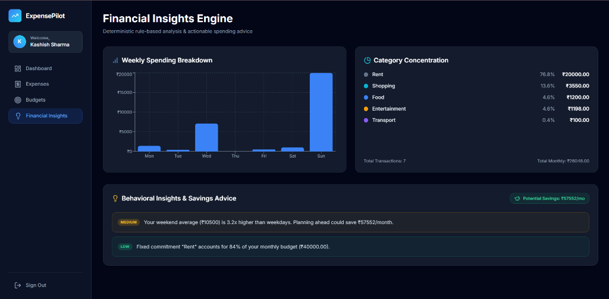

# Expense Pilot — Smart Personal Finance Platform

Expense Pilot is a high-performance, full-stack personal finance application built with a clean 3-tier backend architecture (**Routes → Validation → Services → Database**). It provides complete expense management, category budget enforcement, real-time analytics, and a rule-based financial insights engine.

---

## 📸 Application Screenshots

### 📊 Dashboard Overview


### 💸 Expenses Management & History


### 🎯 Smart Category Budgets


### 💡 Rule-Based Financial Insights Engine


---

## 🏛️ System Architecture

```
Client Layer (React SPA + Vite + Tailwind CSS)
       ↓  HTTP / REST API (JWT Authenticated)
Validation Layer (express-validator / middleware/validate.js)
       ↓  Sanitized Request Data
Service Layer (src/services/insightsService.js & budgetService.js)
       ↓  SQL Prepared Statements
Data Layer (PostgreSQL Database Pool with Indexes & Constraints)
```

```
                        +----------------------------+
                        |  React SPA (Vite + Router) |
                        +----------------------------+
                                      |  HTTP / REST
                                      v
                        +----------------------------+
                        |  Express REST API Gateway  |
                        +----------------------------+
                                      |
              +-----------------------+-----------------------+
              |                       |                       |
              v                       v                       v
      +---------------+       +---------------+       +---------------+
      |  Auth Routes  |       | Expense Routes|       | Insights Route|
      +---------------+       +---------------+       +---------------+
              |                       |                       |
              |                       v (CSV Streaming)       |
              |               +---------------+               |
              +-------------->| Insights      |<--------------+
                              | Service       |
                              +---------------+
                                      |
                                      v
                              +---------------+
                              | PostgreSQL DB |
                              | (Indexed Pool)|
                              +---------------+
```

---

## 🛠️ Tech Stack & Rationalization

* **Frontend**: React 18 SPA, Vite 5, React Router DOM v6, Tailwind CSS, Recharts, Lucide React.
* **Backend**: Node.js, Express.js (3-tier layered architecture).
* **Database**: PostgreSQL with connection pooling (`pg`), explicit indexes on `(user_id, date)` and `(user_id, category)`.
* **Security & Auth**: JWT (JSON Web Tokens), `bcryptjs` password hashing, `helmet` security headers, CORS protection.
* **Validation**: `express-validator` middleware for input sanitization and schema verification before service execution.

---

## ✨ Core Features & Engineering Highlights

### 1. Financial Insights Engine (`InsightsService`)
Deterministic, explainable rule-based recommendation engine evaluating user behavior:
- **Category Concentration Alert**: Triggers when a single category accounts for $>40\%$ of total spend.
- **Weekend Spikes**: Warns when average weekend spend exceeds $1.5\times$ weekday averages.
- **Budget Overruns**: Highlights category spend exceeding defined monthly caps.

### 2. Streaming CSV Data Export (`GET /api/expenses/export`)
- Streams user expense history directly to browser as an attachment using HTTP `Content-Disposition` and `text/csv` headers.

### 3. Smart Budget Shield
- Category-level monthly caps with real-time SQL calculations (`LEFT JOIN` / subqueries) comparing actual spend vs. limits with warning progress indicators.

### 4. Expense Management & Search
- Full CRUD operations with server-side pagination, category filtering, and keyword search across notes/categories.

---

## 📁 Repository Structure

```
expense pilot/
├── api/                           # Backend Express REST API
│   ├── src/
│   │   ├── app.js                 # App setup, CORS, Helmet, router mounts
│   │   ├── server.js              # HTTP server listener
│   │   ├── db/
│   │   │   ├── pool.js            # PostgreSQL Connection Pool singleton
│   │   │   └── schema.sql         # SQL DDL (Users, Expenses, Budgets + Indexes)
│   │   ├── middleware/
│   │   │   ├── auth.js            # JWT protection middleware
│   │   │   ├── validate.js        # Request validation interceptor
│   │   │   └── errorHandler.js    # Global error response handler
│   │   ├── routes/
│   │   │   ├── auth.js            # Authentication routes (/api/auth)
│   │   │   ├── expenses.js        # Expense CRUD & CSV export (/api/expenses)
│   │   │   ├── budgets.js         # Budget caps & progress (/api/budgets)
│   │   │   └── insights.js        # Financial insights & analytics (/api/insights)
│   │   └── services/              # Domain Business Logic Layer
│   │       └── insightsService.js # Business rules & SQL aggregations
│   └── package.json
│
└── frontend/                      # Pure React SPA Client
    ├── index.html
    ├── vite.config.js
    ├── src/
    │   ├── App.jsx                # React Router DOM v6 route definitions
    │   ├── main.jsx               # React entry point
    │   ├── components/Layout.jsx  # Navigation sidebar & layout frame
    │   ├── lib/api.js             # Axios client with JWT interceptors
    │   └── pages/                 # SPA Views (Dashboard, Expenses, Budgets, Insights)
    └── package.json
```

---

## 🚀 Quick Start

### 1. Database Setup
```bash
createdb expense_tracker
psql expense_tracker < api/src/db/schema.sql
```

### 2. Start API Gateway (Port 5000)
```bash
cd api
cp .env.example .env    # Configure DATABASE_URL & JWT_SECRET
npm install
npm run dev
```

### 3. Start Frontend Client (Port 3000)
```bash
cd frontend
npm install
npm run dev
```

---

## 📝 Recommended Resume Bullet Point

> **Expense Pilot** – Built a full-stack expense management platform using React, Express.js, PostgreSQL, and JWT authentication. Designed RESTful APIs with input validation and CSV streaming, implemented a 3-tier backend architecture (Routes → Validation → Services → DB), and engineered a rule-based financial insights engine to generate deterministic spending advice.
